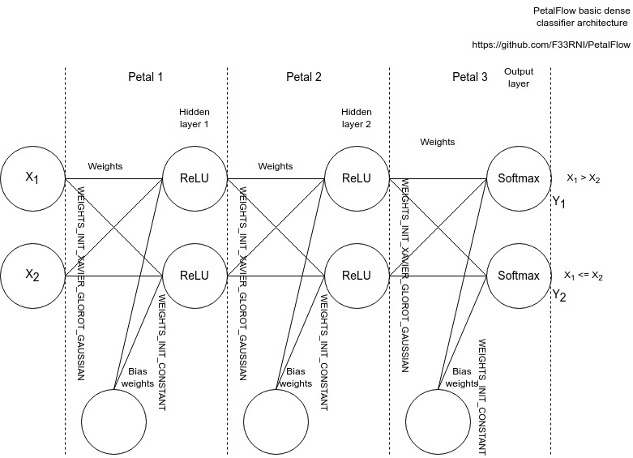

# 🌸 PetalFlow

|  | <h3>A pure C light-weight library for machine learning</h3> |
| ------------------------------------------------------------------- | :---------------------------------------------------------: |

----------

## 🚧 PetalFlow is under heavy development

> Please use with caution and wait for the proper release
>
> Currently, PetalFlow has only been tested on Linux and Windows with x86_64 architecture
>
> In the future, it is planned to extend its usability even to **AVR / ARM / ESP** (such as Arduino / STM / ESP boards)
> In the future it is planned to use it even on AVR (like Arduino)

## 📝 TODO for the near future

- Add convolution layers
- Python bindings
- Test on ARM and AVR
- More tests and examples

----------

## 📚 Building shared library

It's possible to build shared library using `cmake`

```shell
cmake -B build -DTESTS=OFF -DLOGGER_LEVEL=1
cmake --build build --config Release
```

Shared library will be located inside `build` directory

----------

## 🏗️ Getting started

Below is an example of an extremely simple classifier capable of just comparing two numbers and showing whether the first number is greater than, equal to, or less than the second



1. Include base libraries

    ```c
    #include <stdint.h>
    #include <stdio.h>
    #include <stdlib.h>

    #include "flower.h"
    ```

2. Add functions to print array and create demo dataset

    <details>
    <summary>Click to show code</summary>

    ```c
    /**
     * @brief Prints 1D array as 1D or multidimensional array
     *
     * @param array pointer to array
     * @param rows number of rows (height)
     * @param cols number of columns (width)
     * @param depth number of channel (depth)
     */
    void print_array(float *array, uint32_t rows, uint32_t cols, uint32_t depth) {
        for (uint32_t row = 0; row < rows; ++row) {
            for (uint32_t col = 0; col < cols; ++col) {
                if (depth > 1)
                    printf("(");
                for (uint32_t channel = 0; channel < depth; ++channel) {
                    printf("%.4f", array[(row * cols + col) * depth + channel]);

                    if (channel < depth - 1)
                        printf(", ");
                }
                if (depth > 1)
                    printf(")");
                printf("\t");
            }
            printf("\n");
        }
    }

    /**
     * @brief Generates 2D array of random integers from -10 to 10 as floats
     *
     * @param rows number of rows (outer array length)
     * @param cols number of elements in each internal array
     * @return float** 2D array of random integers as floats
     */
    float **dense_generate_input_data(uint32_t rows, uint32_t cols) {
        // Allocate memory for the outer array (rows)
        float **array = (float **) malloc(rows * sizeof(float *));
        if (!array) {
            printf("Error allocating array for dense_generate_input_data!\n");
            return NULL;
        }

        for (uint32_t row = 0; row < rows; ++row) {
            // Allocate memory for each internal array (columns)
            array[row] = (float *) malloc(cols * sizeof(float));
            if (!array[row]) {
                printf("Error allocating array[row] for dense_generate_input_data!\n");
                return NULL;
            }

            // Populate the internal array with random float values
            for (uint32_t col = 0; col < cols; ++col) {
                array[row][col] = (float) (int16_t) (((float) rand() / RAND_MAX) * 10 - 5);
            }
        }
        return array;
    }

    /**
     * @brief Generates 2D array of expected outputs by comparing 1st and 2nd
     * elements of input_data array
     *
     * @param input_data 2D array of random integers as floats
     * @param rows number of rows (outer array length)
     * @return float** true outputs (cols = 3)
     */
    float **dense_generate_output_data(float **input_data, uint32_t rows) {
        // Allocate memory for the outer array (rows)
        float **array = (float **) malloc(rows * sizeof(float *));
        if (!array) {
            printf("Error allocating array for dense_generate_output_data!\n");
            return NULL;
        }

        for (uint32_t row = 0; row < rows; ++row) {
            // Allocate memory for each internal array (columns)
            array[row] = (float *) calloc(3U, sizeof(float));
            if (!array[row]) {
                printf("Error allocating array[row] for "
                    "dense_generate_output_data!\n");
                return NULL;
            }

            // 1 > 2
            if (input_data[row][0] > input_data[row][1])
                array[row][0] = 1.f;

            // 1 = 2
            else if (input_data[row][0] == input_data[row][1])
                array[row][1] = 1.f;

            // 1 < 2
            else
                array[row][2] = 1.f;
        }
        return array;
    }
    ```

    </details>

3. Initialize datasets

    <details>
    <summary>Click to show code</summary>

    ```c
    // Set random seed
    srand(123);

    // 500 numbers from -5 to 5: 80% train, 20% validation
    uint32_t train_dataset_length = 400;
    uint32_t validation_dataset_length = 100;

    // Generate validation datasets
    float **train_dataset_inputs = dense_generate_input_data(train_dataset_length, 2U);
    float **validation_dataset_inputs = dense_generate_input_data(validation_dataset_length, 2U);
    if (!train_dataset_inputs || !validation_dataset_inputs) {
        printf("train_dataset_inputs or validation_dataset_inputs allocation failed\n");
        return -1;
    }

    // Generate outputs
    float **train_dataset_outputs = dense_generate_output_data(train_dataset_inputs, train_dataset_length);
    float **validation_dataset_outputs =
        dense_generate_output_data(validation_dataset_inputs, validation_dataset_length);
    if (!train_dataset_outputs || !validation_dataset_outputs) {
        printf("train_dataset_outputs or est_dataset_outputs allocation failed\n");
        return -1;
    }
    ```

    </details>

4. Initialize petals

    > Initializes petal's struct and petal's weights if needed Sets petal->error_code in case of error.
    >
    > **Parameters**
    > - `petal_type`: type of the petal (PETAL_TYPE_...)
    > - `first`: true if it's the first petal (output_left is input data) to prevent error_on_input calculation
    > - `input_shape`: pointer to `petal_shape_s` struct:
    >   - `rows`: height of input data
    >   - `cols`: width (or size for 1D) of input data
    >   - `depth`: number of channels of input data
    >   - `length`: calculates internally
    > - `output_shape`: pointer to `petal_shape_s` struct:
    >   - `rows`: height of output data
    >   - `cols`: width (or size for 1D) of output data
    >   - `depth`: number of channels of output data
    >   - `length`: calculates internally
    > - `weights`: pointer to `weights_s` struct (for `PETAL_TYPE_DENSE_1D`) or NULL for other types:
    >   - `trainable`: 1 if weights will be trained or 0 if not
    >   - `initializer`: weights initializer (`WEIGHTS_INIT_...`)
    >   - `weights`: pass NULL to initialize weights or pointer to previously initialized weights
    >   - `center`: constant for `WEIGHTS_INIT_CONSTANT` or center of distribution for other initializers
    >   - `deviation`: deviation of distribution (ignored for `WEIGHTS_INIT_CONSTANT`)
    > - `bias_weights`: pointer to `weights_s` struct (for `PETAL_TYPE_DENSE_1D`) or NULL for other types:
    >   - `trainable`: 1 if bias weights will be trained or 0 if not
    >   - `initializer`: bias weights initializer (`WEIGHTS_INIT_...`)
    >   - `weights`: pass NULL to initialize bias weights or pointer to previously initialized bias weights
    >   - `center`: constant for `WEIGHTS_INIT_CONSTANT` or center of distribution for other initializers
    >   - `deviation`: deviation of distribution (ignored for `WEIGHTS_INIT_CONSTANT`)
    > - `activation`: pointer to `activation_s` struct or NULL to disable activation:
    >   - `type`: activation function (`ACTIVATION_...`)
    >   - `linear_alpha`: factor for linear activation (ax + c) (for `ACTIVATION_LINEAR` only). Default = 1.0
    >   - `linear_const`: constant for linear activation (ax + c) (for `ACTIVATION_LINEAR` only). Default = 0.0
    >   - `relu_leak`: leak amount (for `ACTIVATION_RELU` only). Default = 0.01
    >   - `elu_alpha`: the value to which an ELU saturates for negative net inputs (for `ACTIVATION_ELU` only). Default = 0.01
    >   - `swish_beta`: beta for turning Swish into E-Swish (for `ACTIVATION_SWISH` only). Default = 1.0
    > - `dropout`: ratio of dropped outputs (0 to 1)
    > - `center`: center of normalization for `PETAL_TYPE_NORMALIZE_...` Default: 0.0
    > - `deviation`: deviation of normalization for `PETAL_TYPE_NORMALIZE_...` Default: 1.0
    >
    > **Returns**
    > - `petal_s*`: petal's struct

    **Available weights initializers:**
   - `WEIGHTS_INIT_CONSTANT`
   - `WEIGHTS_INIT_RANDOM_UNIFORM`
   - `WEIGHTS_INIT_RANDOM_GAUSSIAN`
   - `WEIGHTS_INIT_XAVIER_GLOROT_UNIFORM`
   - `WEIGHTS_INIT_XAVIER_GLOROT_GAUSSIAN`
   - `WEIGHTS_INIT_KAIMING_HE_UNIFORM`
   - `WEIGHTS_INIT_KAIMING_HE_GAUSSIAN`

    **Available activation functions:**
   - `ACTIVATION_LINEAR`
   - `ACTIVATION_RELU`
   - `ACTIVATION_ELU`
   - `ACTIVATION_SOFTSIGN`
   - `ACTIVATION_SIGMOID`
   - `ACTIVATION_HARD_SIGMOID`
   - `ACTIVATION_SWISH`
   - `ACTIVATION_SOFTMAX`
   - `ACTIVATION_TANH`

    ```c
    petal_s *petal_hidden1 =
        petal_init(PETAL_TYPE_DENSE_1D, true, &(petal_shape_s){1U, 2U, 1U, 0UL}, &(petal_shape_s){1U, 2U, 1U, 0UL},
                    &(weights_s){true, WEIGHTS_INIT_XAVIER_GLOROT_GAUSSIAN, 4U, NULL, NULL, 0.f, 1.f, NULL, NULL, 0U},
                    &(weights_s){true, WEIGHTS_INIT_CONSTANT, 2U, NULL, NULL, 0.f, 1.f, NULL, NULL, 0U},
                    &(activation_s){ACTIVATION_RELU, 1.f, 0.f, 0.0f, 0.00f, 1.f, NULL}, 0.0f, 0.f, 1.f);
    petal_s *petal_hidden2 =
        petal_init(PETAL_TYPE_DENSE_1D, false, &(petal_shape_s){1U, 2U, 1U, 0UL}, &(petal_shape_s){1U, 2U, 1U, 0UL},
                    &(weights_s){true, WEIGHTS_INIT_XAVIER_GLOROT_GAUSSIAN, 4U, NULL, NULL, 0.f, 1.f, NULL, NULL, 0U},
                    &(weights_s){true, WEIGHTS_INIT_CONSTANT, 2U, NULL, NULL, 0.f, 1.f, NULL, NULL, 0U},
                    &(activation_s){ACTIVATION_RELU, 1.f, 0.f, 0.0f, 0.00f, 1.f, NULL}, 0.0f, 0.f, 1.f);
    petal_s *petal_output =
        petal_init(PETAL_TYPE_DENSE_1D, false, &(petal_shape_s){1U, 2U, 1U, 0UL}, &(petal_shape_s){1U, 3U, 1U, 0UL},
                    &(weights_s){true, WEIGHTS_INIT_XAVIER_GLOROT_GAUSSIAN, 6U, NULL, NULL, 0.f, 1.f, NULL, NULL, 0U},
                    &(weights_s){true, WEIGHTS_INIT_CONSTANT, 3U, NULL, NULL, 0.f, 1.f, NULL, NULL, 0U},
                    &(activation_s){ACTIVATION_SOFTMAX, 1.f, 0.f, 0.0f, 0.01f, 1.f, NULL}, 0.0f, 0.f, 1.f);
    ```

5. Review generated weights

    ```c
    printf("In -> hidden 1 weights:\n");
    print_array(petal_hidden1->weights->weights, 2U, 2U, 1U);
    printf("In -> hidden 1 bias weights:\n");
    print_array(petal_hidden1->bias_weights->weights, 1U, 2U, 1U);

    printf("hidden 1 -> hidden 2 weights:\n");
    print_array(petal_hidden2->weights->weights, 2U, 2U, 1U);
    printf("hidden 1 -> hidden 2 bias weights:\n");
    print_array(petal_hidden2->bias_weights->weights, 1U, 2U, 1U);

    printf("hidden 2 -> out weights:\n");
    print_array(petal_output->weights->weights, 2U, 3U, 1U);
    printf("hidden 2 -> out bias weights:\n");
    print_array(petal_output->bias_weights->weights, 1U, 3U, 1U);
    ```

    ```text
    In -> hidden 1 weights:
    0.5437  1.9291
    0.5761  0.0142
    In -> hidden 1 bias weights:
    0.0000  0.0000
    hidden 1 -> hidden 2 weights:
    0.5512  -0.5755
    -0.2741 1.4943
    hidden 1 -> hidden 2 bias weights:
    0.0000  0.0000
    hidden 2 -> out weights:
    -0.0618 -2.1608 0.8753
    0.9752  0.2948  0.8927
    hidden 2 -> out bias weights:
    0.0000  0.0000  0.0000
    ```

6. Initialize flower

    > Initializes flower using array of petals.
    >
    > **Parameters**
    > - `petals`: pointer to an array of pointers of petals
    > - `petals_length`: number of petals
    >
    > **Returns**
    > - `flower_s*`: initialized flower

    ```c
    petal_s *petals[] = {petal_hidden1, petal_hidden2, petal_output};
    flower_s *flower = flower_init(petals, 3U);
    ```

7. Show model output before training

    X1 = 1, X2 = 2

    ```c
    // Show prediction before training
    printf("Before training [1.0, 2.0] -> [1 > 2, 1 == 2, 1 < 2]:\t\t");
    print_array(flower_predict(flower, (float[]){1.f, 2.f}), 1U, 3U, 1U);
    ```

    ```text
    Before training [1.0, 2.0] -> [1 > 2, 1 == 2, 1 < 2]:           0.0989  0.6936  0.2075
    ```

8. Initialize optimizer and metrics

    > **Parameters**
    > - `type`: optimizer type (`OPTIMIZER_...`)
    > - `learning_rate`: learning rate (required for all optimizer types) Default: 0.01
    > - `momentum`: accelerates gradient descent and dampens oscillations (for `OPTIMIZER_SGD_MOMENTUM`)
    > - `beta_1`: hyperparameter (for `OPTIMIZER_RMS_PROP` and `OPTIMIZER_ADAM`) Default: 0.9
    > - `beta_2`: hyperparameter (for `OPTIMIZER_ADAM`) Default: 0.999

    **Available metrics:**
   - `METRICS_TIME_ELAPSED`
   - `METRICS_LOSS_TRAIN`
   - `METRICS_ACCURACY_TRAIN`
   - `METRICS_LOSS_VALIDATION`
   - `METRICS_ACCURACY_VALIDATION`

    ```c
    // Initialize optimizer
    optimizer_s optimizer = (optimizer_s){OPTIMIZER_ADAM, .1f, 0.f, .89f, .99f};

    // Initialize metrics
    metrics_s *metrics = metrics_init(1);
    metrics_add(metrics, METRICS_TIME_ELAPSED);
    metrics_add(metrics, METRICS_LOSS_TRAIN);
    metrics_add(metrics, METRICS_ACCURACY_TRAIN);
    metrics_add(metrics, METRICS_LOSS_VALIDATION);
    metrics_add(metrics, METRICS_ACCURACY_VALIDATION);
    ```

9. Train model

    > Early implementation of backpropagation learning.
    >
    > **Parameters**
    > - `flower`: pointer to initialized `flower_s` struct
    > - `loss_type`: loss function (`LOSS_...`)
    > - `optimizer`: pointer to initialized `optimizer_s` struct with the following parameters:
    >   - `type`: optimizer type (`OPTIMIZER_...`)
    >   - `learning_rate`: learning rate (required for all optimizer types) Default: 0.01
    >   - `momentum`: accelerates gradient descent and dampens oscillations (for `OPTIMIZER_SGD_MOMENTUM`)
    >   - `beta_1`: hyperparameter (for `OPTIMIZER_RMS_PROP` and `OPTIMIZER_ADAM`) Default: 0.9
    >   - `beta_2`: hyperparameter (for `OPTIMIZER_ADAM`) Default: 0.999
    > - `metrics`: pointer to initialized `metrics_s` struct
    > - `inputs_train`: pointer to array of arrays of training input data (train dataset)
    > - `outputs_true_train`: pointer to array of arrays of training output data (train dataset)
    > - `outputs_true_train_sparse`: pointer to array of `label_s` arrays of sparse training output data (1 = [0, 1, ...])
    > - `train_length`: number of training samples (size of training dataset)
    > - `inputs_validation`: pointer to array of arrays of validation input data (validation dataset)
    > - `outputs_true_validation`: pointer to array of arrays of validation output data (train dataset)
    > - `outputs_true_validation_sparse`: pointer to array of `label_s` arrays of sparse validation output data
    > - `validation_length`: number of validation samples (size of validation dataset)
    > - `batch_size`: samples per batch
    > - `epochs`: total number of training epochs

    **Available loss functions:**
    - `LOSS_MEAN_SQUARED_ERROR`
    - `LOSS_MEAN_SQUARED_LOG_ERROR`
    - `LOSS_ROOT_MEAN_SQUARED_LOG_ERROR`
    - `LOSS_MEAN_ABS_ERROR`
    - `LOSS_BINARY_CROSSENTROPY`
    - `LOSS_CATEGORICAL_CROSSENTROPY`

    ```c
    uint32_t epochs = 10;
    uint32_t batch_size = 40;
    flower_train(flower, LOSS_CATEGORICAL_CROSSENTROPY, &optimizer, metrics, train_dataset_inputs,
                 train_dataset_outputs, NULL, train_dataset_length, validation_dataset_inputs,
                 validation_dataset_outputs, NULL, validation_dataset_length, batch_size, epochs);
    ```

    ```text
    [2024-02-26 00:23:41] [INFO] [flower_train] Training started
    [2024-02-26 00:23:41] [INFO] [flower_train] Epoch: 1/10
    [====================] 10/10 | 00:00:00 | Tloss:   0.8024 | Tacc:  60.00% | Vloss:   1.0109 | Vacc:  67.33%
    [2024-02-26 00:23:41] [INFO] [flower_train] Epoch: 2/10
    [====================] 10/10 | 00:00:00 | Tloss:   0.7931 | Tacc:  60.00% | Vloss:   0.9701 | Vacc:  67.33%
    [2024-02-26 00:23:41] [INFO] [flower_train] Epoch: 3/10
    [====================] 10/10 | 00:00:00 | Tloss:   0.7703 | Tacc:  78.33% | Vloss:   0.8245 | Vacc:  73.33%
    [2024-02-26 00:23:41] [INFO] [flower_train] Epoch: 4/10
    [====================] 10/10 | 00:00:00 | Tloss:   0.4864 | Tacc:  90.00% | Vloss:   0.5614 | Vacc:  84.67%
    [2024-02-26 00:23:41] [INFO] [flower_train] Epoch: 5/10
    [====================] 10/10 | 00:00:00 | Tloss:   0.3254 | Tacc:  93.33% | Vloss:   0.3961 | Vacc:  88.00%
    [2024-02-26 00:23:41] [INFO] [flower_train] Epoch: 6/10
    [====================] 10/10 | 00:00:00 | Tloss:   0.2256 | Tacc:  93.33% | Vloss:   0.2979 | Vacc:  89.33%
    [2024-02-26 00:23:41] [INFO] [flower_train] Epoch: 7/10
    [==============>     ]  7/10 | 00:00:06 | Tloss:   0.2180 | Tacc:  95.00% | Vloss:   0.2135 | Vacc:  97.33%
    ...
    ```

10. Test the result

    ```c
    // Test training result on new data
    printf("After training [1.0, 20.0] -> [1 > 2, 1 == 2, 1 < 2]:\t\t");
    print_array(flower_predict(flower, (float[]){1.f, 20.f}), 1U, 3U, 1U);
    printf("After training [5.0, 5.0] -> [1 > 2, 1 == 2, 1 < 2]:\t\t");
    print_array(flower_predict(flower, (float[]){5.f, 5.f}), 1U, 3U, 1U);
    printf("After training [-1.0, -100.0] -> [1 > 2, 1 == 2, 1 < 2]:\t");
    print_array(flower_predict(flower, (float[]){-1.f, -100.f}), 1U, 3U, 1U);
    ```

    ```text
    After training [1.0, 20.0] -> [1 > 2, 1 == 2, 1 < 2]:           0.0000  0.0000  1.0000
    After training [5.0, 5.0] -> [1 > 2, 1 == 2, 1 < 2]:            0.0000  0.5291  0.4709
    After training [-1.0, -100.0] -> [1 > 2, 1 == 2, 1 < 2]:        0.9722  0.0274  0.0004
    ```

11. Free memory

    ```c
    // Destroy internal array of weights
    weights_destroy(petal_hidden1->weights, false, true);
    weights_destroy(petal_hidden1->bias_weights, false, true);
    weights_destroy(petal_hidden2->weights, false, true);
    weights_destroy(petal_hidden2->bias_weights, false, true);
    weights_destroy(petal_output->weights, false, true);
    weights_destroy(petal_output->bias_weights, false, true);

    // Destroy flower without destroying petals
    flower_destroy(flower, false, false, false);

    // Destroy metrics
    metrics_destroy(metrics);
    ```

----------

## 🧾 Logging

PetalFlow has a simple logging implementation for formatting debug, info, warning and error messages

> **logger()**
>
> ```c
> void logger(uint8_t level,
>             const char *tag,
>             const char *message_or_format,
>             ... )
> ```
>
> Formats and prints logging entry.
>
> **Parameters**
>
> - `level`: logging level (`LOG_D`, `LOG_I`, `LOG_W`, `LOG_E`, or `LOG_NONE`)
> - `tag`: logging tag (for example, name of function)
> - `message_or_format`: message to log or format for other arguments
> - `...`: other logger arguments, for example: `logger(LOG_I, "TAG", "Hello world %d, %.2f", 123, 4.5678f);` would result in `[YYYY-MM-DD HH:MM:SS] [INFO] [TAG] Hello world 123, 4.57`

You can enable logging by defining `LOGGING` (for gcc: `-DLOGGING`). Other available definitions:

- `LOGGER_LEVEL <value>` - Minimal allowed logging level. Default: `LOG_I`
  - `LOG_D` - 0
  - `LOG_I` - 1
  - `LOG_W` - 2
  - `LOG_E` - 3
  - `LOG_NONE` - 255
- `LOGGER_DISABLE_TIME` - Define to **disable** printing current time
- `LOGGER_TIME_FORMAT <value>` - Time formatter. Default: `"[%Y-%m-%d %H:%M:%S]"`
- `LOGGER_DISABLE_LEVEL` - Define to **disable** printing current entry level
- `LOGGER_LEVEL_FIXED` - Define to **enable** fixed-width logging level printing
- `LOGGER_LEVEL_FIXED_FORMAT <value>` - Fixed-width level formatter. Default: `"[%-7s]"`
- `LOGGER_DISABLE_TAG` - Define to **disable** printing tag

----------

## ✅ Tests and examples

You can find more examples in `test/main.c` file

You can build `petalflow_tests` target by using `cmake`:

```shell
cmake -B build -DTESTS=ON -DLOGGER_LEVEL=1
cmake --build build --config Release

build/petalflow_tests
```

Or by using `gcc`:

```shell
gcc -o petalflow test/main.c src/*.c -Iinclude -DLOGGING -DLOGGER_LEVEL=1 -lm

./petalflow
```

----------

## 📄 Documentation

You can build Doxygen documentation using provided `Doxygen` file

Just clone repo and run:

```shell
doxygen
```

This will generate HTML and LaTeX with the following structure:

```text
docs
├── html
│   ├── activation_8c.html
...
│   ├── index.html
...
│   └── weights_8h_source.html
└── latex
    ├── activation_8c.tex
    ...
    ├── Makefile
    ...
    └── weights_8h.tex
```
